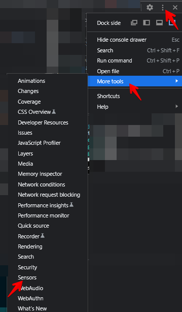
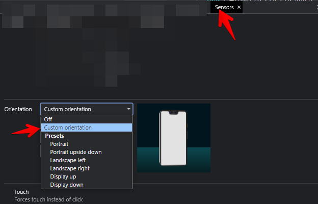

# Report Danger
Created for Dev Challenge XIX Final

## Description
This project is a compass with ability to report flying dangers.

## Technical information
The solution is based on vanilla ts with no libs using [Vite](https://vitejs.dev/) as a bundler.

I'm using component based approach with custom elements. All components are in `src/components` folder.
- The `rd-app` component is responsible for rendering the app. It also contains state manager
- The `rd-compass` component is responsible for rendering the compass and heading of the compass.
- The `rd-swiper` component is responsible for handling user swiper.

`geolocation.service.ts` is responsible to work with cities direction and predictions.

`constants.ts` contains generic constants for the app.

## Available functionality
- The compass is rendered with the ability to rotate it when you rotate the phone
- Ability to draw an arrow
- Detecting what city is under the threat
- Ability to report the danger
- PWA support

## How to run
1. Clone the repo
2. Run `npm install`
3. Run `npm run dev`
> Note: Make sure that you test app on localhost or added your host to 'unsafely-treat-insecure-origin-as-secure'. Otherwise Chrome won't allow to get 
> geolocation

> Note 2: if you want to test it on PC, make sure that you enabled orientation sensor in chrome 

## How to test
1. Clone the repo
2. Run `npm install`
3. Run `npm test`
